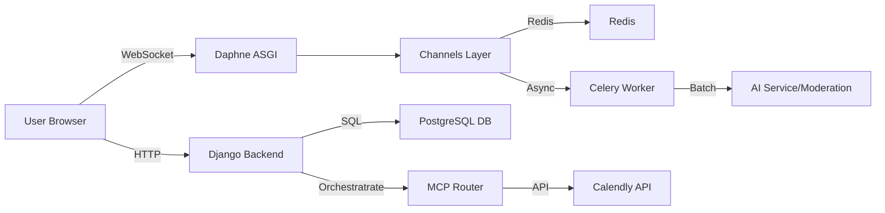
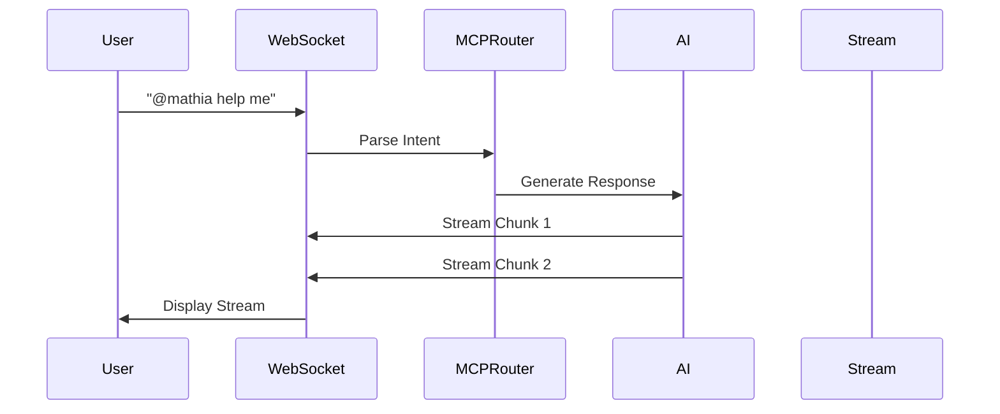

### SYS DESIGN FOR MATHIA PROJECT
This project is designed to create an interactive chatbot interface for users to communicate with each other and with an AI-powered assistant. The system is built using Django for the backend (ASGI) and HTML/CSS/JavaScript for the frontend. The chatbot supports real-time messaging, multi-room chats, AI response streaming, and a responsive design.

The main components of the system include:
1. **Frontend (HTML/CSS/JavaScript)**:
   - **Multi-room Support**: Users can join and switch between multiple chatrooms instantly.
   - **AI Response Streaming**: Real-time character-by-character streaming of AI responses.
   - **Context Panel**: Dynamic right-side panel for context-aware actions.
   - **Calendly Integration Panel**: UI for connecting Calendly accounts and viewing status.

2. **Backend (Django & Channels)**:
   - **Authentication**: Custom user model with robust onboarding flow.
   - **WebSocket Handling**: Django Channels with Redis for real-time state.
   - **Background Tasks (Celery)**: Handles heavier async tasks like AI moderation and notifications.
   - **Periodic Tasks (Celery Beat)**: Manages scheduled jobs.
   - **MCP Router (Orchestration)**: Routing engine for user intents to connectors (Calendly, etc.).

3. **Database & Storage**:
   - **PostgreSQL**: Primary relational database for users, chats, and wallets (Dockerized).
   - **Redis**: Used as the Channel Layer for WebSockets and specialized caching/buffering.

4. **Key Features**:
   - **User Onboarding**: Multi-step wizard collecting Profile, Professional Goals, and Workspace details.
   - **Wallet System**: Internal `Wallet` model supporting atomic Credits/Debits for workspace billing.
   - **AI Personalization**: `GoalProfile` stores user goals to contextually adapt AI responses.
   - **AI Moderation**: Messages are buffered in Redis and processed in batches by Celery. Users can be "Muted" automatically.
   - **Calendly Integration**: Connect account, check availability, and schedule meetings via chat.
   - **AI Memory (Context Brain)**: AI remembers important details ("Room Notes") and shares high-priority context across rooms (via `ContextManager`).
   - **Smart Reminders**: Set reminders naturally (e.g., "Remind me to call John in 10 mins"). Executed via Celery background tasks.

### SETUP INSTRUCTIONS
1. Clone the repository to your local machine.
2. Ensure you have **Docker** and **Docker Compose** installed.
3. Configure environment variables in `.env` (see `.env.example`).
4. Build and start the services:
   ```bash
   docker-compose up --build
   ```
   This starts:
   - `web`: Django ASGI application (Daphne/Gunicorn)
   - `db`: PostgreSQL database
   - `redis`: Redis server
   - `celery_worker`: Background task worker
   - `celery_beat`: Periodic task scheduler

5. Run migrations (if not auto-run by entrypoint):
   ```bash
   docker-compose exec web python manage.py migrate
   ```
6. Access the application at `http://localhost:8000`.

### USAGE
1. **Register/Login**: Complete the multi-step onboarding to set up your profile and workspace.
2. **Chat**: 
   - Join existing rooms or create new ones (Invite system available).
   - Use `@mathia` to trigger the AI assistant.
3. **Calendly**:
   - Connect via Settings or `/calendly connect`.
   - Commands: "Check my calendar", "Schedule a meeting".
4. **Wallet**:
   - View balance in Settings -> Wallet.
   - Simulate transactions via admin or implemented flows.
5. **Memory & Reminders**:
   - Open the **Brain Icon** (top right) to see/add notes manually.
   - Ask AI to set reminders: "Remind me at 5pm to check emails".

### CONTRIBUTING
1. Fork the repository and create a new branch.
2. Follow PEP8 (Python) and project coding standards.
3. Testing: Ensure new features have unit tests or manual verification steps.
4. Submit a Pull Request with a clear description.

### SYSTEMS OVERVIEW

#### Component Graph


#### User to AI Communication


### MATHIA — Developer Guide

This section maps the codebase to the system architecture.

**High-level summary**
- **Infrastructure**: Dockerized setup with Django, PostgreSQL, Redis, and Celery.
- **Realtime**: Django Channels (ASGI) using `channels_redis`.
- **Encryption**: Per-room AES-GCM encryption in `chatbot/consumers.py`.
- **Moderation**: Redis-buffered message queues processed by Celery tasks (`chatbot/tasks.py`).

**Important Files**
- `Backend/Backend/settings.py`: Configuration for Channels, Celery, and DB.
- `Backend/chatbot/consumers.py`: Core WebSocket logic, presence, and key rotation.
- `Backend/chatbot/tasks.py`: Celery tasks for moderation, AI generation, and Reminders.
- `Backend/chatbot/context_manager.py`: The AI Brain (Memory & Context).
- `Backend/users/models.py`: `Wallet`, `GoalProfile`, `Workspace` models.
- `Backend/orchestration/`: MCP Router and AI intent logic.

**Developer Contract**
- **Inputs**: WebSocket JSON commands (`new_message`, `typing`, `file_message`).
- **Outputs**: Real-time JSON events (`presence_update`, `ai_stream_chunk`).
- **Data Shapes**: Messages are stored with `nonce` and `data` (encrypted).

**Edge Cases**
- **Redis Failures**: Disables real-time features; static HTTP views remain functional.
- **Rate Limiting**: Enforced per-minute via `check_rate_limit`.
- **Moderation**: High-volume rooms buffer messages; check `MODERATION_BATCH_SIZE`.

Generated based on current codebase analysis: `users`, `chatbot`, and `orchestration` apps.
