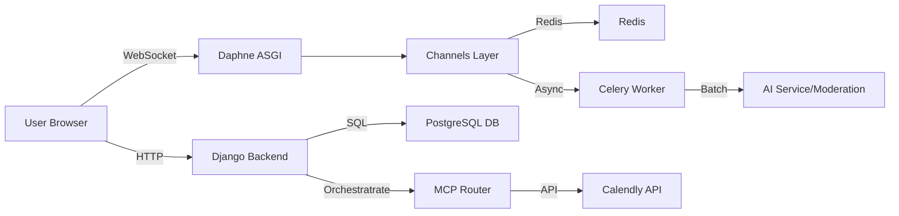

### SYS DESIGN FOR MATHIA PROJECT
This project is designed to create an interactive chatbot interface for users to communicate with each other and with an AI-powered assistant. The system is built using Django for the backend (ASGI) and HTML/CSS/JavaScript for the frontend. The chatbot supports real-time messaging, multi-room chats, AI response streaming, and a responsive design.

The main components of the system include:
1. **Frontend (HTML/CSS/JavaScript)**:
   - **Multi-room Support**: Users can join and switch between multiple chatrooms instantly.
   - **AI Response Streaming**: Real-time character-by-character streaming of AI responses.
   - **Context Panel**: Dynamic right-side panel for context-aware actions.
   - **Calendly Integration Panel**: UI for connecting Calendly accounts and viewing status.

2. **Backend (Django & Channels)**:
   - **Authentication**: Custom user model with robust onboarding flow.
   - **WebSocket Handling**: Django Channels with Redis for real-time state.
   - **Background Tasks (Celery)**: Handles heavier async tasks like AI moderation and notifications.
   - **Periodic Tasks (Celery Beat)**: Manages scheduled jobs.
   - **MCP Router (Orchestration)**: Routing engine for user intents to connectors (Calendly, etc.).

3. **Database & Storage**:
   - **PostgreSQL**: Primary relational database for users, chats, and wallets (Dockerized).
   - **Redis**: Used as the Channel Layer for WebSockets and specialized caching/buffering.

4. **Key Features**:
   - **User Onboarding**: Multi-step wizard collecting Profile, Professional Goals, and Workspace details.
   - **Wallet System**: Internal `Wallet` model supporting atomic Credits/Debits for workspace billing.
   - **AI Personalization**: `GoalProfile` stores user goals to contextually adapt AI responses.
   - **AI Moderation**: Messages are buffered in Redis and processed in batches by Celery. Users can be "Muted" automatically.
   - **Calendly Integration**: Connect account, check availability, and schedule meetings via chat.
   - **AI Memory (Context Brain)**: AI remembers important details ("Room Notes") and shares high-priority context across rooms (via `ContextManager`).
   - **Smart Reminders**: Set reminders naturally (e.g., "Remind me to call John in 10 mins"). Executed via Celery background tasks.

### SETUP INSTRUCTIONS
1. Clone the repository to your local machine.
2. Ensure you have **Docker** and **Docker Compose** installed.
3. Configure environment variables in `.env` (see `.env.example`).
4. Build and start the services:
   ```bash
   docker-compose up --build
   ```
   This starts:
   - `web`: Django ASGI application (Daphne/Gunicorn)
   - `db`: PostgreSQL database
   - `redis`: Redis server
   - `celery_worker`: Background task worker
   - `celery_beat`: Periodic task scheduler

5. Run migrations (if not auto-run by entrypoint):
   ```bash
   docker-compose exec web python manage.py migrate
   ```
6. Access the application at `http://localhost:8000`.

### USAGE
1. **Register/Login**: Complete the multi-step onboarding to set up your profile and workspace.
2. **Chat**: 
   - Join existing rooms or create new ones (Invite system available).
   - Use `@mathia` to trigger the AI assistant.
3. **Calendly**:
   - Connect via Settings or `/calendly connect`.
   - Commands: "Check my calendar", "Schedule a meeting".
4. **Wallet**:
   - View balance in Settings -> Wallet.
   - Simulate transactions via admin or implemented flows.
5. **Memory & Reminders**:
   - Open the **Brain Icon** (top right) to see/add notes manually.
   - Ask AI to set reminders: "Remind me at 5pm to check emails".

### CONTRIBUTING
1. Fork the repository and create a new branch.
2. Follow PEP8 (Python) and project coding standards.
3. Testing: Ensure new features have unit tests or manual verification steps.
4. Submit a Pull Request with a clear description.

### SYSTEMS OVERVIEW

#### Component Graph


#### User to AI Communication
```mermaid
sequenceDiagram
    participant User
    participant WebSocket
    participant MCPRouter
   ```markdown
   # MATHIA — System Design & Developer README

   This repository implements an interactive chat platform (Mathia) with a Django ASGI backend, AI orchestration, and real-time messaging.

   Key features:
   - Real-time chat (Django Channels + Redis)
   - AI assistant with streaming responses and intent routing
   - Connectors for external services (Calendly, Giphy, Weather, Payments)
   - Background jobs and periodic tasks handled by Celery

   ## Quickstart (Docker / PowerShell)

   Recommended: use Docker Compose for a reproducible dev environment.

   PowerShell example:
   ```powershell
   # build and start services
   docker-compose up --build

   # run migrations inside the web container
   docker-compose exec web python Backend/manage.py migrate

   # run Django tests inside the web container
   docker-compose exec web python Backend/manage.py test
   ```

   If you prefer running locally without Docker, ensure you have Redis and Postgres (or rely on the sqlite fallback in `settings.py`). Start the ASGI server with:
   ```powershell
   python Backend/manage.py runserver
   # or use daphne/uvicorn for ASGI in prod-like runs
   ```

   ## Environment variables
   - The project expects a `.env` file at the repository root (one level above `Backend/`). Important variables (examples):
     - `DJANGO_SECRET_KEY`, `DJANGO_DEBUG`, `DJANGO_ALLOWED_HOSTS`
     - `REDIS_URL` (required in production; supports `rediss://` for Upstash)
     - `DATABASE_URL` (defaults to sqlite for quick dev)
     - LLM keys: `ANTHROPIC_API_KEY`, `HF_API_TOKEN`
     - Connector keys: `OPENWEATHER_API_KEY`, `GIPHY_API_KEY`, `EXCHANGE_RATE_API_KEY`, `CALENDLY_CLIENT_ID`, `CALENDLY_CLIENT_SECRET`

   ## Architecture (high-level)
   - Backend: Django  (ASGI) with Channels for WebSockets. See `Backend/Backend/settings.py` for Channels and Celery configuration.
   - Orchestration: `Backend/orchestration/` contains the MCP Router (`mcp_router.py`) which validates intents, routes to connectors, and caches results in Redis.
   - LLM client: `Backend/orchestration/llm_client.py` — unified client that prefers Anthropic (Claude) and falls back to Hugging Face Router. Use `get_llm_client()`.
   - Connectors: write async connectors under `Backend/orchestration/connectors/`; they follow `BaseConnector` shape.
   - Background tasks: `Backend/chatbot/tasks.py` contains Celery tasks for moderation, reminder processing and other heavy work.

   ## Important files to inspect first
   - `Backend/Backend/settings.py` — Redis/channel/celery settings and security toggles.
   - `Backend/chatbot/consumers.py` — WebSocket handlers, encryption, and presence logic.
   - `Backend/chatbot/tasks.py` — Celery tasks and moderation batching (`CELERY_BEAT_SCHEDULE` defined in settings).
   - `Backend/orchestration/mcp_router.py` — Intent routing and connector examples (Calendly connector demonstrates token refresh).
   - `Backend/orchestration/llm_client.py` — LLM call patterns, streaming helper, and `extract_json()` helper.

   ## Conventions & patterns
   - Connectors should implement: async `execute(parameters: Dict, context: Dict) -> Any` and return structured dicts (status/message/data). Register them in `MCPRouter.connectors`.
   - Use `asgiref.sync.sync_to_async` when calling Django ORM from async code (see examples in `mcp_router.py`).
   - Respect environment feature flags in `settings.py`; keys missing are handled gracefully by connectors returning a useful error message.

   ## Running & debugging tips
   - If Redis is unavailable, WebSocket features degrade — HTTP views still work. Inspect logs for Redis connection issues (startup prints REDIS_URL).
   - To iterate on LLM behavior, modify `llm_client.py` but keep `generate_text` / `stream_text` semantics.
   - To test a connector locally, add a small unit test under `Backend/orchestration/tests.py` using Django test client with a mocked external response.

   ## Contributing
   - Fork, create a branch, add tests for new behavior, run `python Backend/manage.py test`, and open a PR with a clear description.

   ---
   If you'd like, I can also:
   - Add a connector skeleton file at `Backend/orchestration/connectors/example_connector.py` and a unit test template.
   - Expand a troubleshooting section with exact PowerShell debugging commands for common errors (Redis, Celery, migrations).

   Generated from the current codebase; open an issue or request to expand any section.
   ```
