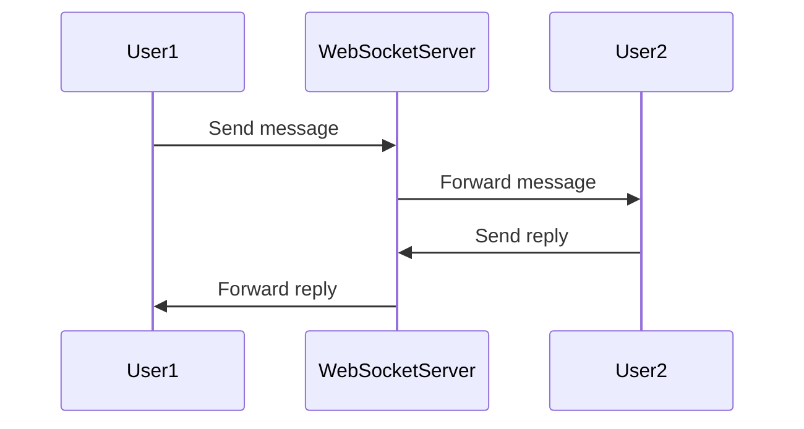
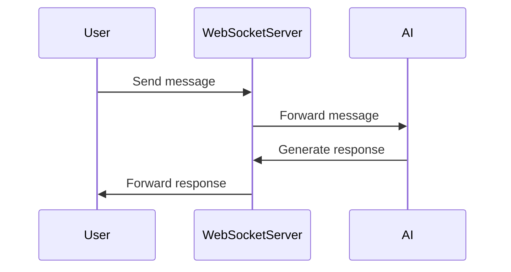

### SYS DESIGN FOR MATHIA PROJECT
This project is designed to create an interactive chatbot interface for users to communicate with each other and with an AI-powered assistant. The system is built using Django for the backend and HTML/CSS/JavaScript for the frontend. The chatbot supports real-time messaging, emoji integration, and a responsive design for various devices.
The main components of the system include:
1. **Frontend (HTML/CSS/JavaScript)**:
   - User interface for chat interactions.
   - Real-time message display and input handling.
   - Emoji picker integration.
2. **Backend (Django)**:
   - Handles user authentication and session management.
   - Manages WebSocket connections for real-time communication.
   - Processes incoming messages and generates responses using AI models.
3. **WebSocket Communication**:
   - Enables real-time messaging between users and the chatbot.
4. **Database**:
   - Stores user data, chat history, and message logs.
5. **AI Integration**:
   - Utilizes AI models to generate responses based on user input.
### SETUP INSTRUCTIONS
1. Clone the repository to your local machine.
2. Navigate to the project directory and create a virtual environment.
3. Install the required dependencies using `pip install -r requirements.txt`.
4. Set up the database by running migrations with `python manage.py migrate`.
5. Start the Django development server using `python manage.py runserver`.
6. Open your web browser and navigate to `http://localhost:8000` to access the chatbot interface.
### USAGE
1. Register or log in to your account.
2. Start a new chat session or join an existing one.
3. Type your messages in the input box and hit enter to send.
4. Use the emoji picker to add emojis to your messages.
5. Interact with the AI-powered chatbot for assistance or information.
### CONTRIBUTING
1. Fork the repository and create a new branch for your feature or bug fix.
2. Make your changes and ensure that the code follows the project's coding standards.
3. Test your changes thoroughly.
4. Submit a pull request with a detailed description of your changes.

### Mermaid Diagram for userto user communication

### Mermaid Diagram for user to AI communication


### mermmaid for the overall system architecture as is in the codebase 
```mermaid
graph TD;
    A[User] -->|Sends Message| B(Chatbot);
    B -->|Generates Response| A;
    B -->|Uses| C[AI Model];
    B -->|Communicates via| D[WebSocket];
    B -->|Stores Data in| E[Database];
    A -->|Interacts with| F[Frontend HTML/CSS/JS];
   ## MATHIA — System Architecture & Developer Guide

   This README replaces the old, high-level doc and maps the current codebase to clear system diagrams and a short systems-design for adding an AI moderation/assistant feature.

   Checklist (what you asked for)
   - Create accurate Mermaid diagrams for current codebase: Done
   - Add architecture/component diagrams reflecting Channels/Redis/ASGI/encryption: Done
   - Add one extra system design for integrating AI for moderation & assistant: Done

   High-level summary
   - Backend: Django (ASGI) using Channels + Daphne for WebSocket support.
   - Realtime: Django Channels with Redis channel layer and Redis used for presence and caching.
   - Encryption: per-room AES-GCM encryption is implemented in `chatbot/consumers.py` (messages are stored encrypted).
   - APIs: DRF endpoints live under the `Api` app (`Api/views.py`) for creating replies and reading chatroom/message objects.

   Important files and where to look
   - `Backend/Backend/settings.py` — ASGI, Channels, Redis, DB and cache configuration.
   - `Backend/chatbot/consumers.py` — WebSocket consumer, presence, encryption/decryption, rate-limiting, file handling.
   - `Backend/Api/views.py` — DRF views for Chatroom / Mathia replies.
   - `Backend/chatbot/models.py` — chat models (Chatroom, Message, Member). (Open this for message storage shapes.)

   Developer contract (small)
   - Inputs: WebSocket JSON commands from authenticated users (commands: `fetch_messages`, `new_message`, `file_message`, `typing`).
   - Outputs: WebSocket JSON messages (presence snapshots, message objects, system errors).
   - Data shapes: Messages saved as JSON blobs containing `data` (encrypted payload) and `nonce` fields. See `Message.content` storage usage in `consumers.py`.
   - Error modes: auth failure (close), decryption failure (logged & ignored), rate-limit (rejected with system message).

   Edge cases to be aware of
   - Redis unavailable — presence and channel layer fail (consumer will error/close).
   - Key rotation / invalid key — decryption fails and messages cannot be read; consumers log the error.
   - Large files — `file_message` paths store files via Django storage; ensure MEDIA_ROOT has capacity and permissions.
   - Rate limiting — enforced per-minute using Django cache; tune `CHAT_RATE_LIMIT` in `Backend/Backend/settings.py`.

   How the live system pieces fit together (component graph)

   ```mermaid
   graph LR
      Browser[User Browser / Frontend]
      Browser -->|HTTP| DjangoHTTP[Backend Django (views, DRF)]
      Browser -->|WebSocket (wss)| DaphneASGI[Daphne → ASGI]
      DaphneASGI --> ChannelsLayer[Channels (ASGI application)]
      ChannelsLayer -->|group_send/group_add| ChatConsumer[ChatConsumer (chatbot/consumers.py)]
      ChatConsumer -->|Channel Layer| Redis[Redis (channels_redis)]
      ChatConsumer -->|presence / last_seen| Redis
      ChatConsumer -->|writes/reads| SQLite[SQLite DB (Message, Chatroom, Member)]
      DjangoHTTP -->|CRUD| SQLite
      DjangoHTTP -->|cache| Redis
      ChatConsumer -->|file uploads| MEDIA[uploads/ (MEDIA_ROOT)]
      ChatConsumer -->|optional AI| AIService[External AI / internal ML service]
   ```

   Sequence: User → User (current code)

   ```mermaid
   sequenceDiagram
         participant A as User A (browser)
         participant ASGI as Daphne/ASGI
         participant C as ChatConsumer
         participant Redis as Redis
         participant DB as Database

         A->>ASGI: WebSocket connect (authenticated)
         ASGI->>C: new connection (scope includes user)
         C->>Redis: SADD online:<room>
         C->>ASGI: accept
         A->>ASGI: send (command: new_message)
         ASGI->>C: receive (text_data)
         C->>C: encrypt message (AES-GCM)
         C->>DB: save Message (content: {data, nonce})
         C->>Redis: publish presence/message via channel layer
         C->>ASGI: forward to connected clients
         ASGI->>A: client receives message
   ```

   Sequence: User → AI (design-ready)

   ```mermaid
   sequenceDiagram
         participant User
         participant ASGI as Daphne/ASGI
         participant C as ChatConsumer
         participant AI as AI Service

         User->>ASGI: send message (private room or invoke bot)
         ASGI->>C: receive
         C->>AI: (1) moderation check OR (2) assistant query via HTTP/GRPC
         AI-->>C: classification / response
         C->>DB: optionally store AI result/flag
         C->>ASGI: forward moderated/AI response to user(s)
         ASGI->>User: delivered
   ```

   AI Integration — system design (moderation & assistant)

   Goals: provide per-room AI moderation in private rooms and an assistant bot users can talk to in a dedicated room.

   High-level options
   - Option A (recommended, incremental): External AI moderation + assistant via an HTTP microservice. ChatConsumer calls the service synchronously (fast classification) or asynchronously via a task queue for heavier processing.
   - Option B: Host a lightweight model inside the infrastructure (requires GPU/serving infra). Not recommended initially.

   Recommended architecture (Option A)

   - Components to add:
      - AI Microservice (HTTP API) — accepts plaintext (or decrypted) message and returns {action: allow|block|flag, reason, assistant_reply?: text}
      - Task queue (Celery/RQ) for non-blocking assistant responses or heavy analysis
      - Audit DB table `ModerationAction` to record flags and decisions

   - Flow (moderation + assistant):
      1. ChatConsumer receives `new_message`.
      2. Consumer decrypts message locally (it already has the per-room AES key) and forwards a copy (or the plaintext) to the AI Microservice.
      3a. If AI returns `block`, the consumer discards the message, sends a `system` message to the sender, and optionally stores a `ModerationAction` record.
      3b. If AI returns `flag`, consumer stores the message but marks it flagged in DB and sends a moderated copy to participants (or hides content) and notifies moderators via a moderator channel.
      3c. If assistant reply requested (user invoked assistant), forward AI's reply message into the same room as a system/assistant message (optionally encrypted with the room key before storing/sending).

   Security & privacy notes
   - Messages at rest are encrypted per-room; the consumer must decrypt before sending plaintext to any external AI. To avoid exposing keys, consider a dedicated AI gateway service that receives only allowed metadata or implement server-side plugin that can run moderation without exporting keys.
   - If you must send plaintext to an external vendor, add explicit logging, consent, and minimal retention policies.

   Implementation quick plan (small steps)
   1. Add `Api` endpoint or internal service client to contact AI microservice for moderation (sync light checks: profanity/toxicity).
   2. Wire a flag in `Message` model (or separate `ModerationAction` model).
   3. Update `chatbot/consumers.py` to call AI before persisting (or persist then update status); handle `block|flag|allow` decisions.
   4. Add admin UI / moderator channels to review flagged messages.

   Minimal dev run notes

   Start Redis (preferred using Docker):

   ```powershell
   # from repository root (PowerShell)
   docker run --name mathia-redis -p 6379:6379 -d redis:7
   ```

   Create venv, install deps and run migrations, then run Daphne (ASGI) to serve channels:

   ```powershell
   python -m venv .venv; . .\.venv\Scripts\Activate.ps1
   pip install -r requirements.txt
   python Backend\manage.py migrate
   # Run Daphne (serves ASGI + Channels)
   .
   # Development: daphne -b 0.0.0.0 -p 8000 Backend.asgi:application
   ```

   Notes for new devs
   - Read `Backend/chatbot/consumers.py` end-to-end — it contains the main realtime logic: presence, connect, disconnect, encryption, and message flows.
   - `Backend/Backend/settings.py` shows the channel layer and Redis configuration and `CACHES` (used for rate-limiting).
   - DRF views for public APIs are in `Backend/Api/`.

   Next steps / suggested follow-ups (optional)
   - Add a small integration test that opens a test WebSocket and performs `new_message` and `fetch_messages` flows.
   - Add a `ModerationAction` model and a DRF endpoint for moderators to review flagged content.

   Requirements coverage
   - Accurate mermaid diagrams: Done (updated diagrams in this README).
   - Architecture diagrams: Done (component graph above reflects Channels/Redis/ASGI/encryption).
   - AI integration system design: Done (Option A recommended plus flow and security notes).

   If you want, I can now:
   - Add a small `ModerationAction` model and migration plus a tiny API to create/read flagged items.
   - Implement a lightweight AI microservice client (sync HTTP) and wire it into `chatbot/consumers.py`.

   ---

   Generated: based on `Backend/Backend/settings.py`, `Backend/chatbot/consumers.py`, and `Backend/Api/views.py`.
