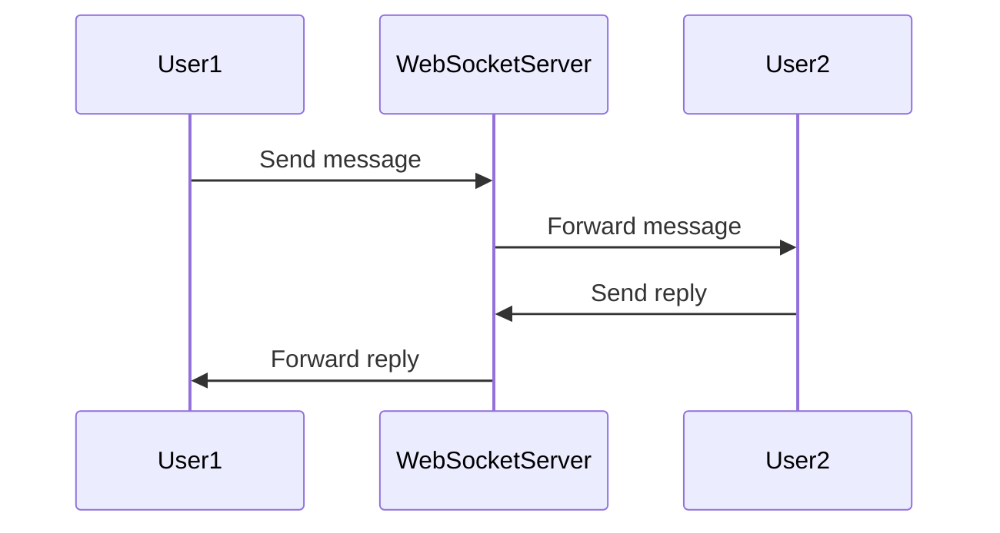
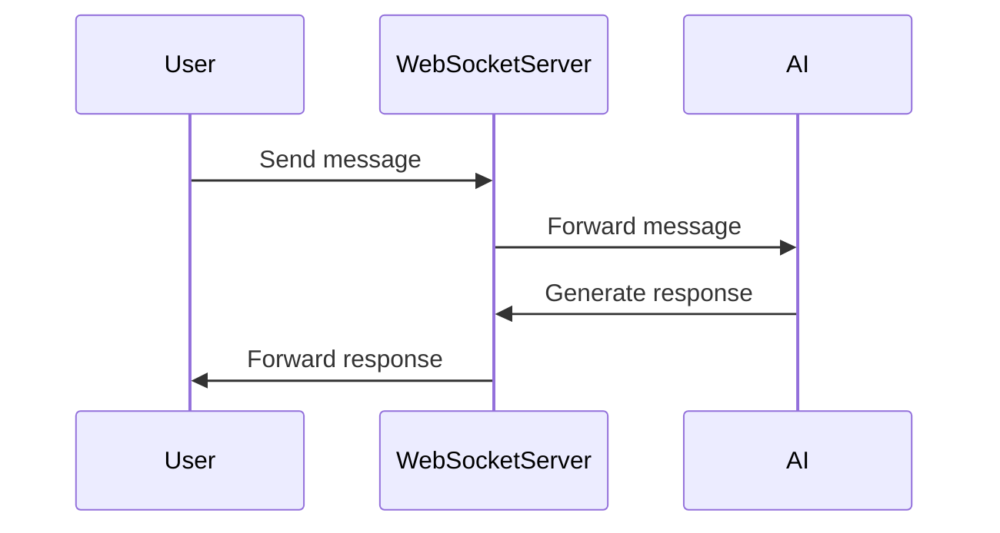
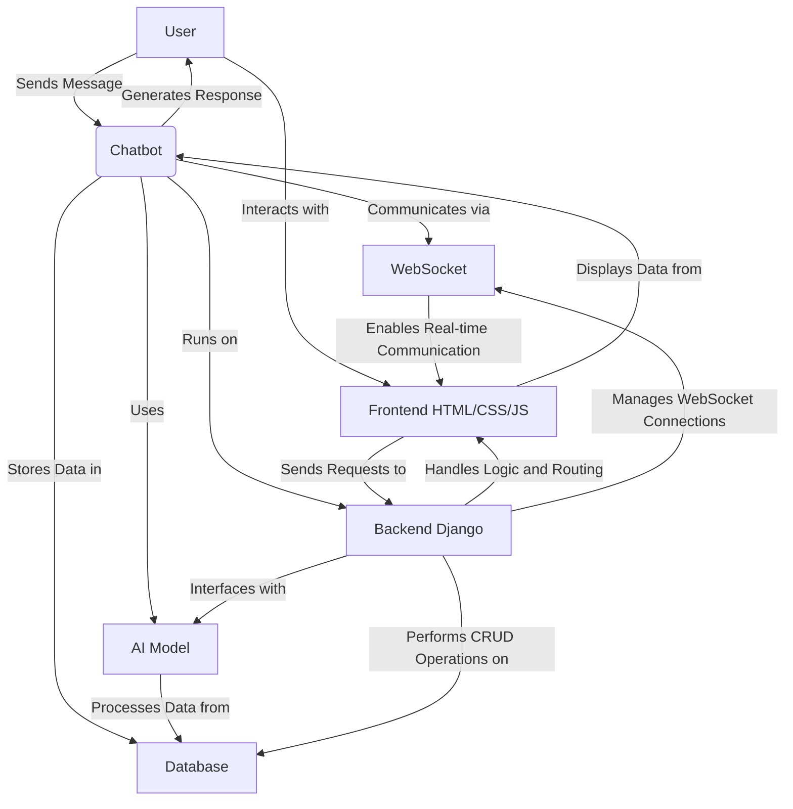

### SYS DESIGN FOR MATHIA PROJECT
This project is designed to create an interactive chatbot interface for users to communicate with each other and with an AI-powered assistant. The system is built using Django for the backend and HTML/CSS/JavaScript for the frontend. The chatbot supports real-time messaging, emoji integration, and a responsive design for various devices.
The main components of the system include:
1. **Frontend (HTML/CSS/JavaScript)**:
   - User interface for chat interactions.
   - Real-time message display and input handling.
   - Emoji picker integration.
2. **Backend (Django)**:
   - Handles user authentication and session management.
   - Manages WebSocket connections for real-time communication.
   - Processes incoming messages and generates responses using AI models.
3. **WebSocket Communication**:
   - Enables real-time messaging between users and the chatbot.
4. **Database**:
   - Stores user data, chat history, and message logs.
5. **AI Integration**:
   - Utilizes AI models to generate responses based on user input.
### SETUP INSTRUCTIONS
1. Clone the repository to your local machine.
2. Navigate to the project directory and create a virtual environment.
3. Install the required dependencies using `pip install -r requirements.txt`.
4. Set up the database by running migrations with `python manage.py migrate`.
5. Start the Django development server using `python manage.py runserver`.
6. Open your web browser and navigate to `http://localhost:8000` to access the chatbot interface.
### USAGE
1. Register or log in to your account.
2. Start a new chat session or join an existing one.
3. Type your messages in the input box and hit enter to send.
4. Use the emoji picker to add emojis to your messages.
5. Interact with the AI-powered chatbot for assistance or information.
### CONTRIBUTING
1. Fork the repository and create a new branch for your feature or bug fix.
2. Make your changes and ensure that the code follows the project's coding standards.
3. Test your changes thoroughly.
4. Submit a pull request with a detailed description of your changes.

### Mermaid Diagram for userto user communication

### Mermaid Diagram for user to AI communication

### mermmaid for the overall system architecture as is in the codebase 

### CHANGES MADE
- Separated JavaScript variables into their own script block in the HTML file for better organization.
- Adjusted CSS properties to improve chat message alignment and chat history height for better user experience.
