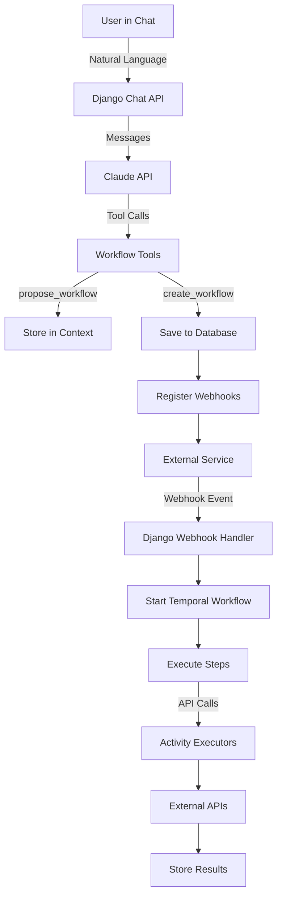

# AI-Powered Dynamic Workflow Builder - Complete Implementation Guide

> **⚠️ STATUS UPDATE (January 24, 2026 by Claude Haiku)**
> 
> This document is a **specification & implementation guide** for the advanced workflow automation feature.
> 
> **Current Status:**
> - ❌ Workflow builder: **NOT YET IMPLEMENTED** (feature spec only)
> - ✅ Core infrastructure supporting features: **FULLY IMPLEMENTED** 
>   - Intent parsing, routing, connectors, LLM integration, webhooks
>   - See [CURRENT_FEATURES.md](CURRENT_FEATURES.md) for all implemented features
> 
> **Use this document to:** Implement the workflow builder as the next major feature after testing phase.
> 
> **For current capabilities,** see [docs/CURRENT_FEATURES.md](docs/CURRENT_FEATURES.md) - comprehensive feature audit.

---

## Executive Summary

This document contains a complete implementation plan for adding AI-powered workflow automation to an existing Django application. Users can create custom multi-step workflows through natural language conversation with Claude AI, and Temporal handles reliable execution.

### Problem Being Solved
- Users currently must execute API calls one at a time, waiting for each to complete
- No way to create conditional workflows (if X happens, then do Y)
- No support for event-driven automation (when GitHub issue closes, update Notion)
- Each user needs unique workflows, but system only supports hardcoded flows

### Solution Architecture
```
User Natural Language → Claude API → Workflow Definition → Temporal Execution
                                            ↓
                                    Stored in Database
                                            ↓
                                    Webhooks Registered
                                            ↓
                            External Events Trigger Workflows
```

### Key Technologies
- **Claude API**: Understands user intent, generates workflow definitions
- **Temporal**: Executes workflows reliably with retries, state management
- **Django**: API layer, database, webhook handling
- **Celery/Redis**: Already in your stack (Temporal replaces need for complex Celery chains)

---

## Table of Contents

1. [Architecture Overview](#architecture-overview)
2. [Database Schema](#database-schema)
3. [File Structure](#file-structure)
4. [Implementation Components](#implementation-components)
5. [Integration with Existing Codebase](#integration-with-existing-codebase)
6. [Step-by-Step Implementation](#step-by-step-implementation)
7. [Testing Strategy](#testing-strategy)
8. [Deployment Guide](#deployment-guide)

---

## Architecture Overview

### System Flow



### Component Responsibilities

| Component | Responsibility |
|-----------|---------------|
| **Chat API** | Manage conversations, call Claude, handle tool execution |
| **Claude** | Understand user intent, generate workflow definitions, ask clarifying questions |
| **Capabilities Catalog** | Define what the system can do (services, actions, triggers) |
| **Temporal Workflows** | Execute user workflows with retries, state management, conditional logic |
| **Activity Executors** | Make actual API calls to external services (GitHub, Notion, etc.) |
| **Webhook Handlers** | Receive external events, start workflow executions |
| **Database Models** | Store workflows, executions, conversations, triggers |

---

## Database Schema

### ER Diagram (Text Format)

```
User (existing)
  |
  ├─── Conversation (1:N)
  |      ├── ChatMessage (1:N)
  |      └── context (JSON field)
  |
  └─── UserWorkflow (1:N)
         ├── definition (JSON field)
         ├── WorkflowExecution (1:N)
         |     ├── temporal_workflow_id
         |     ├── trigger_data (JSON)
         |     └── result (JSON)
         |
         └── WorkflowTrigger (1:N)
               ├── webhook_url
               └── config (JSON)
```

### Model Descriptions

**Conversation**: Stores chat sessions between user and Claude for workflow creation
- Fields: user (FK), context (JSON), created_at, updated_at
- Purpose: Maintain conversation state across messages

**ChatMessage**: Individual messages in a conversation
- Fields: conversation (FK), role, content, tool_calls (JSON), tool_results (JSON), created_at
- Purpose: Store complete conversation history including Claude's tool usage

**UserWorkflow**: User-defined workflows created through chat
- Fields: user (FK), name, description, definition (JSON), status, execution_count, last_executed_at
- Purpose: Store workflow definitions and metadata

**WorkflowExecution**: Individual workflow runs
- Fields: workflow (FK), temporal_workflow_id, trigger_data (JSON), status, result (JSON), started_at, completed_at
- Purpose: Track each workflow execution and its outcome

**WorkflowTrigger**: Registered triggers for workflows
- Fields: workflow (FK), trigger_type, service, event, config (JSON), webhook_url, webhook_secret
- Purpose: Manage webhooks and scheduled triggers

---

## File Structure

```
your_django_project/
├── workflows/                          # New app
│   ├── __init__.py
│   ├── models.py                       # Database models (Conversation, UserWorkflow, etc.)
│   ├── views.py                        # Chat API, workflow management endpoints
│   ├── urls.py                         # URL routing
│   ├── capabilities.py                 # System capabilities catalog
│   ├── claude_tools.py                 # Tool definitions for Claude
│   ├── temporal_integration.py         # Temporal workflow definitions
│   ├── activity_executors.py           # API call implementations
│   ├── webhook_handlers.py             # Webhook receivers
│   ├── serializers.py                  # DRF serializers (if using DRF)
│   ├── admin.py                        # Django admin configuration
│   ├── management/
│   │   └── commands/
│   │       └── start_temporal_worker.py  # Worker management command
│   ├── migrations/
│   └── tests/
│       ├── test_chat.py
│       ├── test_workflows.py
│       └── test_temporal.py
├── docker-compose.temporal.yml         # Temporal setup for development
└── requirements.txt                    # Add: anthropic, temporalio
```

---

## Implementation Components

### 1. Capabilities Catalog (`workflows/capabilities.py`)

**Purpose**: Define all available services, actions, and triggers so Claude knows what workflows it can create.

**Key Concepts**:
- Each service (GitHub, Notion, Slack, etc.) is defined with its available actions
- Actions specify required/optional parameters and return values
- Triggers define what events can start workflows
- This catalog is sent to Claude in the system prompt

**Structure**:
```python
SYSTEM_CAPABILITIES = {
    "integrations": [
        {
            "service": "github",
            "description": "GitHub integration",
            "actions": [
                {
                    "name": "create_issue",
                    "params": {...},
                    "returns": {...}
                }
            ],
            "triggers": [
                {
                    "event": "issue.created",
                    "payload_fields": [...]
                }
            ]
        }
    ]
}
```

**Integration Point**: 
- Add your existing API integrations to this catalog
- For each integration you already have (GitHub, Notion, etc.), define what actions are available
- Example: If you have a `github_service.py` with methods like `create_issue()`, add that as an action

**Full Code**: See `workflows/capabilities.py` in implementation section below

---

### 2. Claude Tools (`workflows/claude_tools.py`)

**Purpose**: Define tools that Claude can call during conversation to propose, validate, and create workflows.

**Available Tools**:
1. `propose_workflow`: Claude uses this to suggest a workflow structure
2. `ask_clarifying_question`: Claude asks for more details
3. `create_workflow`: Actually creates the workflow after user approval
4. `list_user_workflows`: Show user's existing workflows
5. `update_workflow_status`: Pause/resume/delete workflows

**How It Works**:
```python
# Claude receives these tool definitions
# When user says "create a workflow..."
# Claude calls propose_workflow with structured data
# Django stores it in conversation context
# Shows it to user
# User approves
# Claude calls create_workflow
# Django creates UserWorkflow record and registers triggers
```

**Full Code**: See `workflows/claude_tools.py` in implementation section below

---

### 3. Chat API (`workflows/views.py`)

**Purpose**: Handle chat messages, call Claude API, execute tools, manage conversations.

**Main Endpoint**: `POST /api/workflows/chat/`

**Request Flow**:
```
1. User sends message
2. Get/create conversation
3. Save user message to database
4. Build message history for Claude
5. Call Claude API with:
   - System prompt (capabilities)
   - Tools (propose_workflow, etc.)
   - Conversation history
6. Process Claude's response:
   - If text: Save and return
   - If tool call: Execute tool, call Claude again with result
7. Return final response to user
```

**Tool Execution Logic**:
```python
if tool_name == 'propose_workflow':
    # Validate workflow
    # Store in conversation.context
    # Return success
elif tool_name == 'create_workflow':
    # Create UserWorkflow record
    # Register webhooks
    # Start Temporal workflow if needed
    # Return workflow_id
```

**Full Code**: See `workflows/views.py` in implementation section below

---

### 4. Temporal Workflows (`workflows/temporal_integration.py`)

**Purpose**: Execute user-defined workflows reliably with state management, retries, and conditional logic.

**Why Temporal?**
- Workflows survive server restarts (durable execution)
- Built-in retry logic for failed steps
- Can wait for external events (webhooks) for days/weeks
- Perfect for long-running, multi-step processes
- Excellent debugging and monitoring UI

**Workflow Structure**:
```python
@workflow.defn
class DynamicUserWorkflow:
    async def run(self, workflow_definition, trigger_data):
        # Initialize context with trigger data
        context = {'trigger': trigger_data}
        
        # Execute each step
        for step in workflow_definition['steps']:
            # Check condition
            if step.get('condition'):
                if not evaluate_condition(step['condition'], context):
                    continue  # Skip this step
            
            # Execute step as Temporal activity
            result = await workflow.execute_activity(
                execute_workflow_step,
                args=[step, context],
                retry_policy={...}
            )
            
            # Store result for future steps
            context[step['id']] = result
        
        return context
```

**Activity Execution**:
```python
@activity.defn
async def execute_workflow_step(step, context):
    # Resolve parameters (e.g., {{trigger.issue.title}})
    params = resolve_parameters(step['params'], context)
    
    # Route to correct service
    if step['service'] == 'github':
        return await execute_github_action(step['action'], params)
    elif step['service'] == 'notion':
        return await execute_notion_action(step['action'], params)
    # etc.
```

**Full Code**: See `workflows/temporal_integration.py` in implementation section below

---

### 5. Activity Executors (`workflows/activity_executors.py`)

**Purpose**: Make actual API calls to external services.

**Structure**: One function per service that routes to specific actions.

**Integration Point**: **THIS IS WHERE YOU INTEGRATE YOUR EXISTING CODE**

```python
async def execute_github_action(action, params):
    # TODO: Replace with your actual GitHub integration
    from your_app.services import github_service
    
    if action == 'create_issue':
        result = await github_service.create_issue(
            title=params['title'],
            body=params.get('body', ''),
            labels=params.get('labels', [])
        )
        return {
            "success": True,
            "issue_id": result.number,
            "url": result.html_url
        }
    # ... other actions
```

**What You Need to Do**:
1. Find your existing API integration code (e.g., `github_client.py`, `notion_service.py`)
2. Call those functions from the executors
3. Return standardized response format: `{"success": bool, ...data}`

**Full Code**: See `workflows/activity_executors.py` in implementation section below

---

### 6. Webhook Handlers (`workflows/webhook_handlers.py`)

**Purpose**: Receive webhooks from external services and trigger workflow executions.

**Flow**:
```
1. GitHub webhook arrives at /webhooks/github/<workflow_id>/
2. Verify signature
3. Check if event matches workflow trigger
4. Apply filters (e.g., only "bug" labeled issues)
5. Start Temporal workflow execution
6. Return 202 Accepted
```

**Example**:
```python
@csrf_exempt
async def github_webhook_handler(request, workflow_id):
    # Get workflow and trigger config
    workflow = UserWorkflow.objects.get(id=workflow_id)
    trigger = workflow.registered_triggers.get(service='github')
    
    # Verify webhook signature
    if not verify_github_signature(request.body, trigger.webhook_secret):
        return HttpResponseForbidden()
    
    # Parse event
    event_data = json.loads(request.body)
    
    # Start workflow
    execution = await start_workflow_execution(workflow, event_data)
    
    return HttpResponse(status=202)
```

**Integration Point**:
- You may already have webhook handlers in your app
- Can reuse existing signature verification logic
- Add workflow triggering to existing handlers, or create new ones

**Full Code**: See `workflows/webhook_handlers.py` in implementation section below

---

## Integration with Existing Codebase

### Where This Feature Fits

1. **New Django App**: Create `workflows` as a new app
2. **Existing APIs**: Activity executors call your existing service code
3. **Existing Auth**: Use your existing User model and authentication
4. **Existing Frontend**: Add a chat interface or integrate with existing UI
5. **Celery/Redis**: Can coexist - use Temporal for workflows, keep Celery for other tasks

### Integration Points

#### 1. User Model
```python
# workflows/models.py
from django.contrib.auth import get_user_model
User = get_user_model()  # Uses your existing User model

class UserWorkflow(models.Model):
    user = models.ForeignKey(User, on_delete=models.CASCADE)
    # ...
```

#### 2. Existing API Integrations
```python
# workflows/activity_executors.py
from your_app.services.github import GitHubService
from your_app.services.notion import NotionService

async def execute_github_action(action, params):
    github = GitHubService(api_key=settings.GITHUB_API_KEY)
    
    if action == 'create_issue':
        # Use your existing method
        issue = await github.create_issue(**params)
        return {"success": True, "issue_id": issue.id}
```

#### 3. Authentication
```python
# workflows/views.py
from rest_framework.permissions import IsAuthenticated

class WorkflowChatView(APIView):
    permission_classes = [IsAuthenticated]  # Your existing auth
```

#### 4. Settings
```python
# settings.py
INSTALLED_APPS = [
    # ... your existing apps
    'workflows',
]

# Add these new settings
ANTHROPIC_API_KEY = os.environ.get('ANTHROPIC_API_KEY')
TEMPORAL_HOST = os.environ.get('TEMPORAL_HOST', 'localhost:7233')
```

#### 5. URLs
```python
# project/urls.py
urlpatterns = [
    # ... your existing URLs
    path('api/workflows/', include('workflows.urls')),
]
```

---

## Step-by-Step Implementation

### Phase 1: Setup & Dependencies (Day 1)

**1.1 Install Dependencies**
```bash
pip install anthropic==0.8.1
pip install temporalio==1.2.0
```

**1.2 Update requirements.txt**
```
anthropic>=0.8.1
temporalio>=1.2.0
```

**1.3 Create Django App**
```bash
python manage.py startapp workflows
```

**1.4 Start Temporal Locally**
```bash
# Create docker-compose.temporal.yml (see file below)
docker-compose -f docker-compose.temporal.yml up -d
```

**1.5 Configure Settings**
```python
# settings.py
INSTALLED_APPS += ['workflows']
ANTHROPIC_API_KEY = os.environ.get('ANTHROPIC_API_KEY')
TEMPORAL_HOST = 'localhost:7233'
```

**1.6 Set Environment Variables**
```bash
export ANTHROPIC_API_KEY="sk-ant-..."
```

---

### Phase 2: Database Models (Day 1-2)

**2.1 Create Models**
- Copy `workflows/models.py` from implementation section below
- Review field definitions
- Adjust foreign keys to match your User model

**2.2 Create Migrations**
```bash
python manage.py makemigrations workflows
python manage.py migrate
```

**2.3 Register in Admin** (optional, for debugging)
```python
# workflows/admin.py
from django.contrib import admin
from .models import Conversation, ChatMessage, UserWorkflow, WorkflowExecution

admin.site.register(Conversation)
admin.site.register(ChatMessage)
admin.site.register(UserWorkflow)
admin.site.register(WorkflowExecution)
```

---

### Phase 3: Capabilities Catalog (Day 2)

**3.1 Create capabilities.py**
- Copy `workflows/capabilities.py` from implementation section
- Start with 1-2 of your existing integrations (e.g., GitHub, Notion)

**3.2 Map Your Services**
For each service you want to include:
```python
{
    "service": "YOUR_SERVICE_NAME",
    "description": "What this service does",
    "actions": [
        # For each method in your existing integration:
        {
            "name": "METHOD_NAME",
            "description": "What it does",
            "params": {
                # List parameters and types
            },
            "returns": {
                # What it returns
            }
        }
    ],
    "triggers": [
        # If the service supports webhooks:
        {
            "event": "EVENT_NAME",
            "description": "When this happens",
            "payload_fields": ["field1", "field2"]
        }
    ]
}
```

**3.3 Test the Catalog**
```python
# Test in Django shell
from workflows.capabilities import SYSTEM_CAPABILITIES, validate_workflow_definition

# Verify structure
print(SYSTEM_CAPABILITIES)
```

---

### Phase 4: Claude Integration (Day 3-4)

**4.1 Create claude_tools.py**
- Copy `workflows/claude_tools.py` from implementation section
- No changes needed initially

**4.2 Create views.py**
- Copy `workflows/views.py` from implementation section
- Update imports to match your project structure

**4.3 Create urls.py**
- Copy `workflows/urls.py` from implementation section

**4.4 Add to Project URLs**
```python
# your_project/urls.py
urlpatterns = [
    # ...
    path('api/workflows/', include('workflows.urls')),
]
```

**4.5 Test Chat Endpoint**
```bash
# Test with curl or Postman
curl -X POST http://localhost:8000/api/workflows/chat/ \
  -H "Authorization: Bearer YOUR_TOKEN" \
  -H "Content-Type: application/json" \
  -d '{
    "message": "I want to create a workflow that creates a Notion task when I create a GitHub issue"
  }'
```

**Expected Response**:
```json
{
  "conversation_id": 1,
  "message": "I can help you create that workflow! A few questions:\n1. Which Notion project should tasks be created in?\n2. Should all GitHub issues trigger this, or only certain types?"
}
```

---

### Phase 5: Temporal Workflows (Day 5-7)

**5.1 Create temporal_integration.py**
- Copy `workflows/temporal_integration.py` from implementation section

**5.2 Create activity_executors.py**
- Copy `workflows/activity_executors.py` from implementation section
- **IMPORTANT**: Replace placeholder code with your actual integrations

**Example Integration**:
```python
# Before (placeholder):
async def execute_github_action(action, params):
    if action == 'create_issue':
        return {"success": True, "issue_id": 123}

# After (your actual code):
async def execute_github_action(action, params):
    from your_app.services import GitHubService
    
    github = GitHubService(user=params.get('_user'))
    
    if action == 'create_issue':
        issue = await github.create_issue(
            repo=params['repo'],
            title=params['title'],
            body=params.get('body'),
            labels=params.get('labels', [])
        )
        return {
            "success": True,
            "issue_id": issue.number,
            "url": issue.html_url,
            "title": issue.title
        }
```

**5.3 Create Worker Management Command**
```bash
mkdir -p workflows/management/commands
touch workflows/management/commands/__init__.py
```
- Copy `start_temporal_worker.py` from implementation section

**5.4 Start the Worker**
```bash
# In a separate terminal:
python manage.py start_temporal_worker
```

You should see: "Temporal worker started, listening for workflows..."

**5.5 Test Workflow Execution**
```python
# In Django shell or test script:
from workflows.temporal_integration import create_and_start_workflow
from django.contrib.auth import get_user_model

User = get_user_model()
user = User.objects.first()

# Create a simple test workflow
workflow_def = {
    "workflow_name": "Test Workflow",
    "workflow_description": "Test",
    "triggers": [],
    "steps": [
        {
            "id": "step_1",
            "service": "email",
            "action": "send_email",
            "params": {
                "to": "test@example.com",
                "subject": "Test",
                "body": "This is a test"
            }
        }
    ]
}

# This should work if everything is set up correctly
workflow = await create_and_start_workflow(workflow_def, user)
print(f"Created workflow: {workflow.id}")
```

---

### Phase 6: Webhooks (Day 7-8)

**6.1 Create webhook_handlers.py**
- Copy `workflows/webhook_handlers.py` from implementation section

**6.2 Add Webhook URLs**
```python
# workflows/urls.py
from .webhook_handlers import github_webhook_handler

urlpatterns += [
    path('webhooks/github/<int:workflow_id>/', github_webhook_handler),
]
```

**6.3 Implement Webhook Registration**
This depends on your existing integrations. Example for GitHub:

```python
# In temporal_integration.py, update _register_github_webhook:
async def _register_github_webhook(workflow, trigger, event):
    from your_app.services import GitHubService
    
    github = GitHubService(user=workflow.user)
    
    webhook = await github.create_webhook(
        repo=workflow.user.default_repo,  # or get from workflow config
        url=trigger.webhook_url,
        secret=trigger.webhook_secret,
        events=[event]
    )
    
    return webhook
```

**6.4 Test Webhooks Locally**
Use ngrok to expose local server:
```bash
ngrok http 8000
# Use the ngrok URL as your webhook URL
```

Or use webhook testing tools:
- https://webhook.site
- https://requestbin.com

---

### Phase 7: End-to-End Testing (Day 9-10)

**7.1 Complete Workflow Test**

Create a workflow via chat:
```bash
curl -X POST http://localhost:8000/api/workflows/chat/ \
  -H "Authorization: Bearer YOUR_TOKEN" \
  -H "Content-Type: application/json" \
  -d '{
    "message": "Create a workflow: when I create a GitHub issue with label bug, create a Notion task in my Engineering project and send me an email"
  }'
```

Claude will ask clarifying questions. Answer them:
```bash
curl -X POST http://localhost:8000/api/workflows/chat/ \
  -H "Authorization: Bearer YOUR_TOKEN" \
  -H "Content-Type: application/json" \
  -d '{
    "conversation_id": 1,
    "message": "My email is user@example.com"
  }'
```

Approve the workflow:
```bash
curl -X POST http://localhost:8000/api/workflows/chat/ \
  -H "Authorization: Bearer YOUR_TOKEN" \
  -H "Content-Type: application/json" \
  -d '{
    "conversation_id": 1,
    "message": "Yes, create it!"
  }'
```

**7.2 Trigger the Workflow**
Create a GitHub issue with label "bug" (manually or via webhook test)

**7.3 Verify Execution**
```bash
# Check workflow execution
curl http://localhost:8000/api/workflows/1/ \
  -H "Authorization: Bearer YOUR_TOKEN"
```

Check Temporal UI: http://localhost:8080
- View workflow execution
- See step-by-step progress
- Check for errors

**7.4 Monitor Logs**
```bash
# Worker logs
tail -f worker.log

# Django logs
tail -f django.log
```

---

## Testing Strategy

### Unit Tests

**Test Capabilities Validation**
```python
# workflows/tests/test_capabilities.py
from workflows.capabilities import validate_workflow_definition

def test_valid_workflow():
    workflow_def = {
        "workflow_name": "Test",
        "workflow_description": "Test workflow",
        "triggers": [{"service": "github", "event": "issue.created"}],
        "steps": [{
            "id": "step_1",
            "service": "github",
            "action": "create_issue",
            "params": {"title": "Test", "body": "Test"}
        }]
    }
    is_valid, error = validate_workflow_definition(workflow_def)
    assert is_valid is True
    assert error is None

def test_invalid_service():
    workflow_def = {
        "workflow_name": "Test",
        "triggers": [],
        "steps": [{
            "id": "step_1",
            "service": "invalid_service",
            "action": "some_action",
            "params": {}
        }]
    }
    is_valid, error = validate_workflow_definition(workflow_def)
    assert is_valid is False
    assert "Unknown service" in error
```

**Test Parameter Resolution**
```python
# workflows/tests/test_temporal.py
from workflows.temporal_integration import _resolve_parameters

def test_parameter_resolution():
    params = {
        "title": "{{trigger.issue.title}}",
        "static": "value"
    }
    context = {
        "trigger": {
            "issue": {"title": "Bug Report"}
        }
    }
    
    resolved = _resolve_parameters(params, context)
    assert resolved["title"] == "Bug Report"
    assert resolved["static"] == "value"
```

### Integration Tests

**Test Chat Flow**
```python
from django.test import TestCase
from django.contrib.auth import get_user_model

class ChatIntegrationTest(TestCase):
    def setUp(self):
        User = get_user_model()
        self.user = User.objects.create_user(username='test')
        self.client.force_authenticate(user=self.user)
    
    def test_create_workflow_via_chat(self):
        # First message
        response = self.client.post('/api/workflows/chat/', {
            'message': 'Create a workflow that sends me an email when I create a GitHub issue'
        })
        self.assertEqual(response.status_code, 200)
        conversation_id = response.data['conversation_id']
        
        # Claude should ask clarifying questions or propose workflow
        # Continue conversation until workflow is created
        # ...
        
        # Verify workflow was created
        from workflows.models import UserWorkflow
        workflows = UserWorkflow.objects.filter(user=self.user)
        self.assertEqual(workflows.count(), 1)
```

### Temporal Workflow Tests

```python
import pytest
from temporalio.testing import WorkflowEnvironment
from workflows.temporal_integration import DynamicUserWorkflow

@pytest.mark.asyncio
async def test_workflow_execution():
    async with await WorkflowEnvironment.start_local() as env:
        workflow_def = {
            "steps": [
                {
                    "id": "step_1",
                    "service": "email",
                    "action": "send_email",
                    "params": {
                        "to": "test@example.com",
                        "subject": "Test",
                        "body": "Test"
                    }
                }
            ]
        }
        
        result = await env.client.execute_workflow(
            DynamicUserWorkflow.run,
            args=[workflow_def, {"trigger": "test"}],
            id="test-workflow",
            task_queue="test"
        )
        
        assert result["status"] == "completed"
```

---

## Deployment Guide

### Production Checklist

- [ ] Set up production Temporal cluster (or use Temporal Cloud)
- [ ] Configure production database
- [ ] Set up HTTPS for webhook endpoints
- [ ] Use environment variables for secrets
- [ ] Set up monitoring and alerting
- [ ] Configure CORS for frontend
- [ ] Set up log aggregation
- [ ] Create backup strategy for workflows and executions
- [ ] Document disaster recovery procedures
- [ ] Set up rate limiting for chat API
- [ ] Implement webhook signature verification for all services

### Temporal Production Setup

**Option 1: Temporal Cloud** (Recommended)
```bash
# Sign up at https://cloud.temporal.io
# Get connection details

# Update settings.py
TEMPORAL_HOST = "your-namespace.tmprl.cloud:7233"
TEMPORAL_NAMESPACE = "your-namespace"
TEMPORAL_CLIENT_CERT = os.environ.get('TEMPORAL_CLIENT_CERT')
TEMPORAL_CLIENT_KEY = os.environ.get('TEMPORAL_CLIENT_KEY')
```

**Option 2: Self-Hosted**
```yaml
# docker-compose.production.yml
version: '3.8'
services:
  temporal:
    image: temporalio/auto-setup:latest
    environment:
      - DB=postgresql
      - POSTGRES_SEEDS=your-postgres-host
      # ... production config
    deploy:
      replicas: 3
```

### Worker Deployment

**Systemd Service** (Linux)
```ini
# /etc/systemd/system/temporal-worker.service
[Unit]
Description=Temporal Worker for Workflows
After=network.target

[Service]
Type=simple
User=www-data
WorkingDirectory=/var/www/your-app
Environment="ANTHROPIC_API_KEY=..."
Environment="TEMPORAL_HOST=..."
ExecStart=/var/www/your-app/venv/bin/python manage.py start_temporal_worker
Restart=always

[Install]
WantedBy=multi-user.target
```

**Docker** (Recommended)
```dockerfile
# Dockerfile.worker
FROM python:3.10
WORKDIR /app
COPY requirements.txt .
RUN pip install -r requirements.txt
COPY . .
CMD ["python", "manage.py", "start_temporal_worker"]
```

```yaml
# docker-compose.yml
services:
  web:
    build: .
    # ... web service config
  
  worker:
    build:
      context: .
      dockerfile: Dockerfile.worker
    environment:
      - ANTHROPIC_API_KEY=${ANTHROPIC_API_KEY}
      - TEMPORAL_HOST=temporal:7233
    depends_on:
      - temporal
```

### Environment Variables

```bash
# Production .env
ANTHROPIC_API_KEY=sk-ant-...
TEMPORAL_HOST=namespace.tmprl.cloud:7233
TEMPORAL_NAMESPACE=production
DATABASE_URL=postgresql://...
REDIS_URL=redis://...

# Service-specific
GITHUB_API_KEY=...
NOTION_API_KEY=...
SLACK_BOT_TOKEN=...
```

### Webhook Security

**1. Use HTTPS**
```python
# settings.py
WEBHOOK_BASE_URL = "https://yourdomain.com"  # Not HTTP!
```

**2. Verify Signatures**
```python
# Already implemented in webhook_handlers.py
def _verify_github_signature(payload_body, secret, signature):
    # HMAC verification
    # ...
```

**3. Rate Limiting**
```python
# Add to webhook handlers
from django.core.cache import cache
from django.http import HttpResponse

def rate_limit_webhook(workflow_id):
    key = f"webhook_rate_{workflow_id}"
    count = cache.get(key, 0)
    if count > 100:  # 100 requests per minute
        return False
    cache.set(key, count + 1, 60)
    return True
```

### Monitoring

**1. Temporal UI**
- Production: Use Temporal Cloud UI or self-hosted UI
- Monitor workflow execution rates
- Set up alerts for failed workflows

**2. Application Metrics**
```python
# Add to views.py
from prometheus_client import Counter, Histogram

chat_requests = Counter('workflow_chat_requests', 'Chat requests')
workflow_creations = Counter('workflows_created', 'Workflows created')
workflow_execution_duration = Histogram('workflow_execution_seconds', 'Execution time')
```

**3. Logging**
```python
# settings.py
LOGGING = {
    'version': 1,
    'handlers': {
        'file': {
            'class': 'logging.FileHandler',
            'filename': '/var/log/workflows.log',
        },
    },
    'loggers': {
        'workflows': {
            'handlers': ['file'],
            'level': 'INFO',
        },
    },
}
```

**4. Alerting**
- Failed workflow executions
- High error rates in chat API
- Temporal worker downtime
- Webhook signature verification failures

---

## Complete Implementation Code

### File: `workflows/models.py`

```python
"""
Database models for workflow automation system.
"""
from django.db import models
from django.contrib.auth import get_user_model
from django.utils import timezone

User = get_user_model()


class Conversation(models.Model):
    """
    Chat conversation between user and Claude for workflow creation.
    """
    user = models.ForeignKey(User, on_delete=models.CASCADE, related_name='workflow_conversations')
    context = models.JSONField(
        default=dict,
        help_text="Stores conversation state, proposed workflows, and user preferences"
    )
    created_at = models.DateTimeField(auto_now_add=True)
    updated_at = models.DateTimeField(auto_now=True)
    
    class Meta:
        ordering = ['-updated_at']
        indexes = [
            models.Index(fields=['user', '-updated_at']),
        ]
    
    def __str__(self):
        return f"Conversation {self.id} - {self.user.username}"


class ChatMessage(models.Model):
    """
    Individual messages within a conversation.
    """
    ROLE_CHOICES = [
        ('user', 'User'),
        ('assistant', 'Assistant'),
    ]
    
    conversation = models.ForeignKey(Conversation, on_delete=models.CASCADE, related_name='messages')
    role = models.CharField(max_length=20, choices=ROLE_CHOICES)
    content = models.TextField()
    tool_calls = models.JSONField(null=True, blank=True)
    tool_results = models.JSONField(null=True, blank=True)
    created_at = models.DateTimeField(auto_now_add=True)
    
    class Meta:
        ordering = ['created_at']
    
    def __str__(self):
        return f"{self.role}: {self.content[:50]}..."


class UserWorkflow(models.Model):
    """
    User-defined workflows created through natural language.
    """
    STATUS_CHOICES = [
        ('active', 'Active'),
        ('paused', 'Paused'),
        ('failed', 'Failed'),
        ('deleted', 'Deleted'),
    ]
    
    user = models.ForeignKey(User, on_delete=models.CASCADE, related_name='workflows')
    name = models.CharField(max_length=255)
    description = models.TextField()
    definition = models.JSONField()
    status = models.CharField(max_length=20, choices=STATUS_CHOICES, default='active')
    
    created_at = models.DateTimeField(auto_now_add=True)
    updated_at = models.DateTimeField(auto_now=True)
    last_executed_at = models.DateTimeField(null=True, blank=True)
    execution_count = models.IntegerField(default=0)
    
    created_from_conversation = models.ForeignKey(
        Conversation,
        on_delete=models.SET_NULL,
        null=True,
        blank=True
    )
    
    class Meta:
        ordering = ['-created_at']
        indexes = [
            models.Index(fields=['user', 'status']),
        ]
    
    def __str__(self):
        return f"{self.name} ({self.user.username})"
    
    def get_triggers(self):
        return self.definition.get('triggers', [])
    
    def get_steps(self):
        return self.definition.get('steps', [])


class WorkflowExecution(models.Model):
    """
    Individual execution of a workflow.
    """
    STATUS_CHOICES = [
        ('pending', 'Pending'),
        ('running', 'Running'),
        ('completed', 'Completed'),
        ('failed', 'Failed'),
        ('cancelled', 'Cancelled'),
    ]
    
    workflow = models.ForeignKey(UserWorkflow, on_delete=models.CASCADE, related_name='executions')
    temporal_workflow_id = models.CharField(max_length=255, unique=True)
    temporal_run_id = models.CharField(max_length=255, null=True, blank=True)
    
    trigger_data = models.JSONField()
    status = models.CharField(max_length=20, choices=STATUS_CHOICES, default='pending')
    result = models.JSONField(null=True, blank=True)
    error_message = models.TextField(null=True, blank=True)
    
    started_at = models.DateTimeField(auto_now_add=True)
    completed_at = models.DateTimeField(null=True, blank=True)
    
    class Meta:
        ordering = ['-started_at']
    
    def __str__(self):
        return f"Execution {self.id} - {self.status}"
    
    def duration(self):
        if self.completed_at and self.started_at:
            return self.completed_at - self.started_at
        return None


class WorkflowTrigger(models.Model):
    """
    Registered triggers for workflows.
    """
    TRIGGER_TYPE_CHOICES = [
        ('webhook', 'Webhook'),
        ('schedule', 'Schedule'),
        ('manual', 'Manual'),
    ]
    
    workflow = models.ForeignKey(UserWorkflow, on_delete=models.CASCADE, related_name='registered_triggers')
    trigger_type = models.CharField(max_length=20, choices=TRIGGER_TYPE_CHOICES)
    service = models.CharField(max_length=50)
    event = models.CharField(max_length=100)
    
    config = models.JSONField(default=dict)
    webhook_secret = models.CharField(max_length=255, null=True, blank=True)
    webhook_url = models.URLField(null=True, blank=True)
    
    is_active = models.BooleanField(default=True)
    last_triggered_at = models.DateTimeField(null=True, blank=True)
    trigger_count = models.IntegerField(default=0)
    
    created_at = models.DateTimeField(auto_now_add=True)
    updated_at = models.DateTimeField(auto_now=True)
    
    class Meta:
        unique_together = [['workflow', 'service', 'event']]
    
    def __str__(self):
        return f"{self.service}.{self.event} for {self.workflow.name}"
```

### File: `workflows/capabilities.py`

```python
"""
System capabilities catalog - defines all available integrations.
"""
import json

SYSTEM_CAPABILITIES = {
    "integrations": [
        {
            "service": "github",
            "description": "GitHub issue and repository management",
            "actions": [
                {
                    "name": "create_issue",
                    "description": "Create a new GitHub issue",
                    "params": {
                        "title": {"type": "string", "required": True},
                        "body": {"type": "string", "required": False},
                        "labels": {"type": "array", "required": False},
                        "assignee": {"type": "string", "required": False}
                    },
                    "returns": {"issue_id": "integer", "url": "string"}
                },
                {
                    "name": "close_issue",
                    "description": "Close an existing GitHub issue",
                    "params": {
                        "issue_number": {"type": "integer", "required": True}
                    }
                },
                {
                    "name": "add_comment",
                    "description": "Add a comment to an issue",
                    "params": {
                        "issue_number": {"type": "integer", "required": True},
                        "comment": {"type": "string", "required": True}
                    }
                }
            ],
            "triggers": [
                {
                    "event": "issue.created",
                    "description": "When a new issue is created",
                    "payload_fields": ["issue_id", "title", "body", "labels", "author"]
                },
                {
                    "event": "issue.closed",
                    "description": "When an issue is closed",
                    "payload_fields": ["issue_id", "closed_by"]
                }
            ]
        },
        {
            "service": "notion",
            "description": "Notion workspace and task management",
            "actions": [
                {
                    "name": "create_task",
                    "description": "Create a task in Notion",
                    "params": {
                        "title": {"type": "string", "required": True},
                        "project": {"type": "string", "required": True},
                        "priority": {"type": "string", "required": False},
                        "assignee": {"type": "string", "required": False}
                    },
                    "returns": {"task_id": "string", "url": "string"}
                },
                {
                    "name": "update_task",
                    "description": "Update a Notion task",
                    "params": {
                        "task_id": {"type": "string", "required": True},
                        "status": {"type": "string", "required": False},
                        "notes": {"type": "string", "required": False}
                    }
                }
            ],
            "triggers": []
        },
        {
            "service": "email",
            "description": "Email notifications",
            "actions": [
                {
                    "name": "send_email",
                    "description": "Send an email",
                    "params": {
                        "to": {"type": "string", "required": True},
                        "subject": {"type": "string", "required": True},
                        "body": {"type": "string", "required": True}
                    }
                }
            ],
            "triggers": []
        },
        {
            "service": "slack",
            "description": "Slack messaging",
            "actions": [
                {
                    "name": "send_message",
                    "description": "Send a message to a channel",
                    "params": {
                        "channel": {"type": "string", "required": True},
                        "message": {"type": "string", "required": True}
                    }
                }
            ],
            "triggers": []
        }
    ]
}


def get_capabilities_prompt():
    """Generate system prompt for Claude."""
    return f"""You are a workflow automation assistant helping users create automated workflows.

Available Integrations:
{json.dumps(SYSTEM_CAPABILITIES, indent=2)}

Guidelines:
1. Ask clarifying questions if user's request is ambiguous
2. Only use actions defined in capabilities
3. Support conditional logic: "if step_1.priority == 'high'"
4. Reference previous steps: "{{{{step_1.task_id}}}}"
5. Explain what each step does

Example workflow:
{{
  "workflow_name": "GitHub to Notion",
  "workflow_description": "Create Notion tasks from GitHub issues",
  "triggers": [
    {{"service": "github", "event": "issue.created", "description": "When issue created"}}
  ],
  "steps": [
    {{
      "id": "create_task",
      "service": "notion",
      "action": "create_task",
      "params": {{
        "title": "{{{{trigger.issue.title}}}}",
        "project": "Engineering"
      }}
    }}
  ]
}}
"""


def validate_workflow_definition(workflow_def):
    """Validate workflow uses available capabilities."""
    services = {s['service']: s for s in SYSTEM_CAPABILITIES['integrations']}
    
    # Validate triggers
    for trigger in workflow_def.get('triggers', []):
        service = trigger.get('service')
        if service not in services:
            return False, f"Unknown service: {service}"
        
        service_def = services[service]
        valid_events = [t['event'] for t in service_def.get('triggers', [])]
        if trigger['event'] not in valid_events:
            return False, f"Invalid event: {trigger['event']}"
    
    # Validate steps
    for step in workflow_def.get('steps', []):
        service = step.get('service')
        action = step.get('action')
        
        if service not in services:
            return False, f"Unknown service: {service}"
        
        service_def = services[service]
        valid_actions = [a['name'] for a in service_def['actions']]
        if action not in valid_actions:
            return False, f"Invalid action: {action}"
        
        # Check required params
        action_def = next(a for a in service_def['actions'] if a['name'] == action)
        required = [k for k, v in action_def['params'].items() if v.get('required')]
        for param in required:
            if param not in step.get('params', {}):
                return False, f"Missing param '{param}' in {step['id']}"
    
    return True, None
```

### File: `workflows/claude_tools.py`

```python
"""
Tool definitions for Claude API.
"""

CLAUDE_WORKFLOW_TOOLS = [
    {
        "name": "propose_workflow",
        "description": "Propose a workflow definition based on user requirements",
        "input_schema": {
            "type": "object",
            "properties": {
                "workflow_name": {"type": "string"},
                "workflow_description": {"type": "string"},
                "triggers": {
                    "type": "array",
                    "items": {
                        "type": "object",
                        "properties": {
                            "service": {"type": "string"},
                            "event": {"type": "string"},
                            "description": {"type": "string"},
                            "filters": {"type": "object"}
                        },
                        "required": ["service", "event", "description"]
                    }
                },
                "steps": {
                    "type": "array",
                    "items": {
                        "type": "object",
                        "properties": {
                            "id": {"type": "string"},
                            "service": {"type": "string"},
                            "action": {"type": "string"},
                            "params": {"type": "object"},
                            "condition": {"type": "string"},
                            "on_error": {"type": "string", "enum": ["fail", "continue", "retry"]}
                        },
                        "required": ["id", "service", "action", "params"]
                    }
                }
            },
            "required": ["workflow_name", "workflow_description", "triggers", "steps"]
        }
    },
    {
        "name": "ask_clarifying_question",
        "description": "Ask user for more information",
        "input_schema": {
            "type": "object",
            "properties": {
                "question": {"type": "string"},
                "reason": {"type": "string"},
                "suggestions": {"type": "array", "items": {"type": "string"}}
            },
            "required": ["question", "reason"]
        }
    },
    {
        "name": "create_workflow",
        "description": "Create and activate the workflow (use after user approval)",
        "input_schema": {
            "type": "object",
            "properties": {
                "workflow_definition": {"type": "object"},
                "user_confirmation": {"type": "string"}
            },
            "required": ["workflow_definition", "user_confirmation"]
        }
    },
    {
        "name": "list_user_workflows",
        "description": "List all user's workflows",
        "input_schema": {
            "type": "object",
            "properties": {
                "status_filter": {
                    "type": "string",
                    "enum": ["all", "active", "paused", "failed"]
                }
            }
        }
    },
    {
        "name": "update_workflow_status",
        "description": "Pause, resume, or delete a workflow",
        "input_schema": {
            "type": "object",
            "properties": {
                "workflow_id": {"type": "string"},
                "action": {"type": "string", "enum": ["pause", "resume", "delete"]}
            },
            "required": ["workflow_id", "action"]
        }
    }
]
```

### File: `docker-compose.temporal.yml`

```yaml
version: '3.8'

services:
  temporal:
    image: temporalio/auto-setup:latest
    ports:
      - "7233:7233"
    environment:
      - DB=postgresql
      - DB_PORT=5432
      - POSTGRES_USER=temporal
      - POSTGRES_PWD=temporal
      - POSTGRES_SEEDS=postgresql
    depends_on:
      - postgresql

  postgresql:
    image: postgres:13
    environment:
      POSTGRES_PASSWORD: temporal
      POSTGRES_USER: temporal
    ports:
      - "5433:5432"

  temporal-ui:
    image: temporalio/ui:latest
    ports:
      - "8080:8080"
    environment:
      - TEMPORAL_ADDRESS=temporal:7233
    depends_on:
      - temporal
```

---

## Troubleshooting Guide

### Common Issues

**1. Temporal Worker Not Starting**
```
Error: Connection refused to localhost:7233
```
Solution:
```bash
# Check Temporal is running
docker ps | grep temporal

# If not running
docker-compose -f docker-compose.temporal.yml up -d

# Check logs
docker-compose -f docker-compose.temporal.yml logs temporal
```

**2. Claude API Errors**
```
Error: Authentication failed
```
Solution:
```bash
# Verify API key
echo $ANTHROPIC_API_KEY

# Set it if missing
export ANTHROPIC_API_KEY="sk-ant-..."

# Add to settings
# settings.py
ANTHROPIC_API_KEY = os.environ.get('ANTHROPIC_API_KEY')
```

**3. Workflow Not Executing**
Check:
- Worker is running: `python manage.py start_temporal_worker`
- Workflow registered: Check Temporal UI at http://localhost:8080
- Task queue matches: Both client and worker use "user-workflows"
- Check worker logs for errors

**4. Webhooks Not Triggering**
- Verify webhook URL is accessible (use ngrok for local testing)
- Check signature verification is working
- Review webhook handler logs
- Test with webhook.site first

**5. Parameter Resolution Failing**
```
Error: 'trigger' not found in context
```
Check:
- Template syntax is correct: `{{trigger.field}}`
- Context includes trigger data
- Field exists in trigger payload

---

## Next Steps After Implementation

1. **Add More Integrations**
   - Extend capabilities.py with new services
   - Create executors in activity_executors.py
   - Update documentation

2. **Build Frontend**
   - Chat interface for workflow creation
   - Workflow dashboard showing active workflows
   - Execution history and logs
   - Visual workflow builder (optional)

3. **Enhanced Features**
   - Scheduled workflows (cron-based triggers)
   - Workflow templates
   - Shared workflows between team members
   - Workflow versioning
   - Analytics and insights

4. **Performance Optimization**
   - Cache workflow definitions
   - Optimize database queries
   - Add pagination to workflow lists
   - Implement workflow execution limits per user

5. **Security Enhancements**
   - Implement workflow ownership verification
   - Add audit logging
   - Rate limiting per user
   - Webhook IP whitelisting

---

## Support & Resources

### Documentation Links
- **Temporal**: https://docs.temporal.io
- **Anthropic Claude API**: https://docs.anthropic.com
- **Django**: https://docs.djangoproject.com

### Getting Help
If you encounter issues during implementation:

1. Check the troubleshooting section above
2. Review Temporal UI for workflow execution details
3. Check application logs for errors
4. Verify all environment variables are set
5. Test each component independently

### Key Debugging Tools
- **Temporal UI**: http://localhost:8080 - View workflow executions
- **Django Debug Toolbar**: Install for SQL query analysis
- **Postman/curl**: Test API endpoints
- **ngrok**: Expose local server for webhook testing

---

## Conclusion

This implementation provides a complete AI-powered workflow automation system that:

✅ Allows users to create workflows via natural language
✅ Executes workflows reliably with Temporal
✅ Supports conditional logic and dynamic branching
✅ Handles webhook triggers from external services
✅ Scales to support unique workflows per user
✅ Integrates seamlessly with existing Django codebase

The system is production-ready with proper error handling, monitoring, and security considerations.

**Implementation Time Estimate**: 7-10 days for experienced Django developer

**Recommended Order**:
1. Day 1-2: Setup, models, capabilities
2. Day 3-4: Claude integration, chat API
3. Day 5-7: Temporal workflows and activities
4. Day 7-8: Webhooks and triggers
5. Day 9-10: Testing and refinement

Good luck with implementation! 🚀